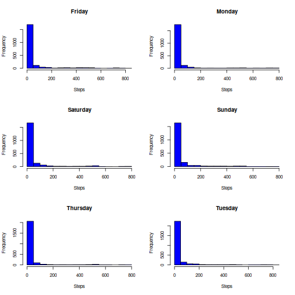

# Reproducible Research: Course project 1

## Github : https://github.com/rasmusongit/reproducible_research_course_project_1


## Exercise 1:
Code for reading in the dataset and/or processing the data

*Reading in the data*:
To read in the data we used <read.csv>

``` r
dataframe <- read.csv("activity.csv", header=TRUE)
print(names(dataframe))
```

```
## [1] "steps"    "date"     "interval"
```
Okay. What dates do we have?

``` r
print(unique(dataframe$date))
```

```
##  [1] "2012-10-01" "2012-10-02" "2012-10-03" "2012-10-04" "2012-10-05"
##  [6] "2012-10-06" "2012-10-07" "2012-10-08" "2012-10-09" "2012-10-10"
## [11] "2012-10-11" "2012-10-12" "2012-10-13" "2012-10-14" "2012-10-15"
## [16] "2012-10-16" "2012-10-17" "2012-10-18" "2012-10-19" "2012-10-20"
## [21] "2012-10-21" "2012-10-22" "2012-10-23" "2012-10-24" "2012-10-25"
## [26] "2012-10-26" "2012-10-27" "2012-10-28" "2012-10-29" "2012-10-30"
## [31] "2012-10-31" "2012-11-01" "2012-11-02" "2012-11-03" "2012-11-04"
## [36] "2012-11-05" "2012-11-06" "2012-11-07" "2012-11-08" "2012-11-09"
## [41] "2012-11-10" "2012-11-11" "2012-11-12" "2012-11-13" "2012-11-14"
## [46] "2012-11-15" "2012-11-16" "2012-11-17" "2012-11-18" "2012-11-19"
## [51] "2012-11-20" "2012-11-21" "2012-11-22" "2012-11-23" "2012-11-24"
## [56] "2012-11-25" "2012-11-26" "2012-11-27" "2012-11-28" "2012-11-29"
## [61] "2012-11-30"
```
Okay. What weekdays do we have?

``` r
print(unique(weekdays(as.Date(dataframe$date))))
```

```
## [1] "Monday"    "Tuesday"   "Wednesday" "Thursday"  "Friday"    "Saturday" 
## [7] "Sunday"
```

``` r
dataframe[["weekdays"]] <- weekdays(as.Date(dataframe$date))
names(dataframe)
```

```
## [1] "steps"    "date"     "interval" "weekdays"
```

``` r
print(unique(dataframe$weekdays))
```

```
## [1] "Monday"    "Tuesday"   "Wednesday" "Thursday"  "Friday"    "Saturday" 
## [7] "Sunday"
```
## Exercise 2:
Histogram of the total number of steps taken each day


``` r
per_weekday <- split(dataframe$steps, dataframe$weekdays)
par(mfrow = c(3, 2))
for (wday in names(per_weekday)) {
    hist(per_weekday[[wday]], main = wday, xlab="Steps", col="blue", breaks=12)
}
```



## Exercise 3:
Mean and median number of steps taken each day


The mean and median number of steps taken per day is:

``` r
means <- tapply(dataframe$steps, dataframe$weekdays, mean, na.rm=TRUE)
medians <- tapply(dataframe$steps, dataframe$weekdays, median, na.rm=TRUE)

result_table <- data.frame(
  mean = means,
  median = medians
)

# Print the table
print(result_table)
```

```
##               mean median
## Friday    42.91567      0
## Monday    34.63492      0
## Saturday  43.52579      0
## Sunday    42.63095      0
## Thursday  28.51649      0
## Tuesday   31.07485      0
## Wednesday 40.94010      0
```
## Exercise 4:
Time series plot of the average number of steps taken

First we need to compute the mean steps taken per day per time interval.
Now, What are the values like in the <interval> column?

``` r
head(dataframe$interval)
```

```
## [1]  0  5 10 15 20 25
```
Then, we can use a tapply call like:

``` r
mean_step_time <- tapply(dataframe$steps, dataframe$interval, mean, na.rm=TRUE)
dim(means)
```

```
## [1] 7
```

``` r
plot(unique(dataframe$interval), mean_step_time, type="l", xlab="Time [minutes]", ylab="Mean steps taken")
```


## Exercise 5:
The 5-minute interval that, on average, contains the maximum number of steps

We can find this using an approach like "argmax".

``` r
argmax_ind <- which.max(mean_step_time)
print(paste("The time interval with the highest number of steps is: ", unique(dataframe$interval)[[argmax_ind]]))
```

```
## [1] "The time interval with the highest number of steps is:  835"
```
## Exercise 6:
Code to describe and show a strategy for imputing missing data

We can do this using <sum> and <is.na> functions.

``` r
print(sum(is.na(dataframe)))
```

```
## [1] 2304
```

We can fill the NAs with the mean value of the weekday they are from using dplyr.

``` r
print(sum(is.na(dataframe)))
```

```
## [1] 2304
```

``` r
library(dplyr)
dataframe_no_na <- dataframe %>%
    group_by(weekdays) %>%
    mutate(steps = ifelse(is.na(steps), mean(steps, na.rm=TRUE), steps))

print(sum(is.na(dataframe)))
```

```
## [1] 2304
```

The new dataset with no NANs is called <dataframe_no_na>.

## Exercise 7:
Histogram of the total number of steps taken each day after missing values are imputed

We can use the same plotting as before.

``` r
per_weekday <- split(dataframe_no_na$steps, dataframe_no_na$weekdays)
par(mfrow = c(3, 2))
for (wday in names(per_weekday)) {
    hist(per_weekday[[wday]], main = wday, xlab="Steps", col="blue", breaks=12)
}
```


## Exercise 8:
Panel plot comparing the average number of steps taken per 5-minute interval across weekdays and weekends


``` r
dataframe_no_na <- dataframe_no_na %>%
                    mutate(weekend = ifelse(
                    weekdays %in% c("Saturday", "Sunday"), 1, 0))
dataframe_no_na <- dataframe_no_na %>%
                    mutate(weekday = ifelse(
                    weekdays %in% c("Monday", "Tuesday", "Wednesday", "Thursday" , "Friday"), 1, 0))


dataframe_no_na$weekendstatus <- ifelse(dataframe_no_na$weekend == 1, "Weekend", "Weekday")

# Aggregate data: calculate the mean of 'gamma' for each 'time' and 'status'
agg_df <- aggregate(steps ~ interval + weekendstatus, data = dataframe_no_na, FUN = mean)

library(ggplot2)
ggplot(agg_df, aes(x = interval, y = steps)) +
  geom_line(aes(color = weekendstatus), size = 1) + 
  facet_wrap(~ weekendstatus, scales = "free", ncol=1) +  
  labs(title = "Mean steps vs interval by Status (Weekend/Weekday)",
       x = "Time",
       y = "Mean steps")
```


## Exercise 9:
All of the R code needed to reproduce the results (numbers, plots, etc.) in the report

